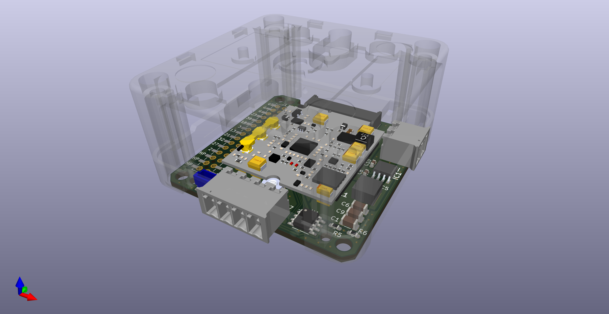

A KiCAD project for a PCB to interface a Blues Wireless Notecard to M5 Stack Core2
Should also work with CoreS3

Intended to fit into a [M5 Base26](https://shop.m5stack.com/products/base26-proto-industrial-board-module-v1-1)

Features Include
- Enables "Outboard DFU", from Notecard to ESP32
- RS485 interface for industrial modbus connections
- 12/24V to 5V buck regulator

